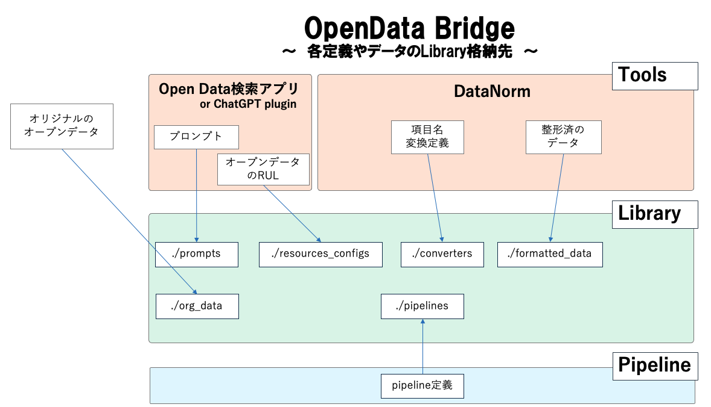

# OpenData-Library

## Libraryの構成
このライブラリの各ディレクトリには以下の内容が保存されています。
- prompts : ChatGPT plugin等を使う場合のprompt
- resources_configs : 目的に対応するデータのダウンロードリンクが記載された定義フィアル
- org_data : ダウンロードしたデータを保管しておく場所、リンク切れの際はここから取得（ライセンスは要確認）
- converters : 項目名の変換定義
- formatted_data : 整形済みのデータ保管場所
- pipelines : 整形処理を自動化するpipeline定義

## OpenData Bridgeの全体図と各定義＆データ配置場所の関係

